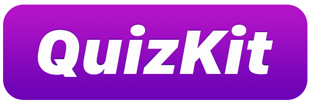

<p align="center">
    
</p>

<p align="center">
    <a href="https://opensource.org/licenses/MIT">
        
    </a> <a href="https://cocoapods.org/pods/QuizKit">
        
    </a>
</p>

---

## About

QuizKit was built to enable rapid development of local or remote quiz apps. It allows for quizzes to be constructed from JSON and supports multiple question types. It handles randomisation of questions, sessions, and scoring.

It works great on iOS and tvOS.

UI is not currently included but an example application will be made available soon and I'm open to including drop-in view controllers in the future.

## Docs

There are three core classes/structs that are visible to you when using QuizKit:

- `QKQuiz` - This is the quiz that has been loaded from JSON. Its sole purpose is to be loaded into a `QKSession`. You may wish to build an app with multiple quizzes which could be separate JSON files or loaded from a JSON string fetched from a remote server.
- `QKSession` - This is the main class that you will interact with. There is a shared instance that is accessible from `QKSession.default`. A quiz is loaded into the session, questions are retreived from here, and responses submitted.
- `QKQuestion` - Individual questions are wrapped in this model. It houses information such as the question, type (using `QKQuestionType`), image, and responses.

### Question types

QuizKit currently supports the following question types, definted on `QKQuestionType`:

- `singleAnswer` - This is an open ended question that would be perfect for a text box.
- `multipleChoice` - Used for questions with multiple text responses.
- `imageChoice` - Similar to `multipleChoice` but the choices are instead image based instead of text.

### Loading a quiz and starting a session

There are two initialisers for loading a quiz that work in the same way. The first you can pass the path to a JSON file included locally in your app and the second takes a JSON string directly.

The below example is how you would load a quiz on a `UIViewController` from a JSON file. 

```swift
import QuizKit

class ExampleViewController: UIViewController {

    override func viewDidLoad() {
        super.viewDidLoad()
        loadQuiz()
    }

    func loadQuiz() {
        guard let path = Bundle.main.path(forResource: "quiz", ofType: "json") else {
            return
        }
        
        QKSession.default.limit = 10
        
        if let quiz = QKQuiz(loadFromJSONFile: path) {
            QKSession.default.load(quiz: quiz)
        }
    }
    
    @IBAction func startQuiz(_ sender: Any) {
        do {
            try QKSession.default.start()
        } catch {
            fatalError("Quiz started without quiz set on the session")
        }
        
        if let question = QKSession.default.nextQuestion() {
            // SHOW THE QUESTION VIEW HERE
        }
    }
    
}
```

The `startQuiz` method in this example has been wired up to a button in interface builder. When the user taps the button a new session is started.

The `QKSession.default.nextQuestion()` method accepts an optional question in order to return the next correctly. A `QKQuestion` or `nil` is returned dependent on whether its the last question in the session.

There is currently one option `QKSession.default.limit` to set the number of questions in a session.

### Submitting a response

Entering a response to a question is done via the `QKSession.default.submit(response: String, for: QKQuestion)` method. The first parameter is the response the user has given as a string (for an image choice question submit the URL of the image). The second parameter is the `QKQuestion` instance the user is responding to.

```swift
QKSession.default.submit(response: "User Response Here", for: question)
```

### Retreiving the score

When the user has finished the quiz a score can be obtained from `QKSession`.

An integer value of the number of questions the user got correct is available as well as a string formatted like `7 / 10`.

```swift
let integerScore = QKSession.default.score
let stringScore = QKSession.default.formattedScore
```

Individual results for each question are also accessible should you wish to display to the user which questions they got right or wrong.

```swift
let individualResults = QKSession.default.responses
```

### Examples

An [example JSON file is available here](readme-resources/example-quiz.json).

An example app will be available soon.

## Installation

### Manual

QuizKit currently relies on [SwiftyJSON](https://github.com/SwiftyJSON/SwiftyJSON) to parse the JSON files and strings. If you wish to install QuizKit in your project manually you'll need to also include SwiftyJSON as well as the `Sources` directory from this repository.

### CocoaPods

CocoaPods is an easier way to install QuizKit and its dependencies. Simply include the following in your project's `Podfile`.

```ruby
pod 'QuizKit'
```

## Todo

- [ ] Potentially implement JSON parsing in-project to avoid SwiftyJSON dependency.
- [ ] Add additional initialisers for quizzes such as CSV or Plist.
- [ ] Add example application.